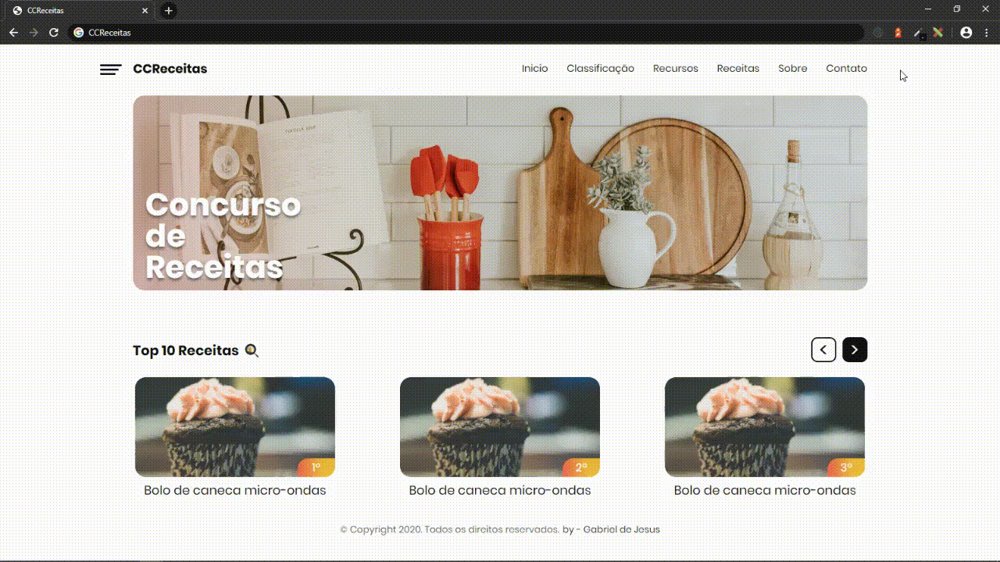
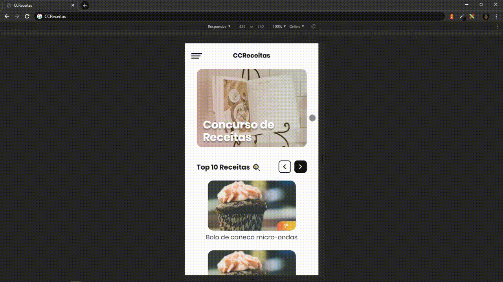
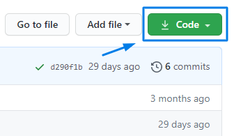
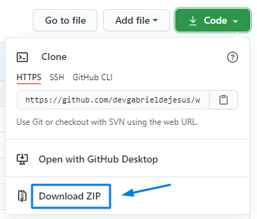

_English_

# CCReceitas

📖 CCReceitas is a fully online recipe contest platform.

💡 Some say that cooking is a trail of good. The recipe for a preparation seems simple, passes from generation to generation and, with each hand, it becomes even better.
Now have you ever imagined yourself participating in a completely online recipe contest? Yes, in CCReceitas this is possible!

`Web preview`


`Mobile preview`


## 📈 Example usage

Landing page with the destination of putting my knowledge into html and css into practice.

## 💻 Configuration for Development

Windows:

You can clone the repository through CMD (Command Prompt) just by typing:

```sh
git clone https://github.com/devgabrieldejesus/ccreceitas
```

or download the zip from the green button at the beginning of the repository





## 🗃 Release history

* 0.1.0
    * Project finalized and studying the possibility of adding new resources
    * The first suitable launch
* 0.0.1
    * Work in progress

## 📝 Meta

Gabriel de Jesus – [My portfolio](https://gabrieldesenvolvedor.com/) – oi@gabrieldesenvolvedor.com

Distributed under the MIT License. See `LICENSE` for more information.

[https://github.com/devgabrieldejesus/ccreceitas](https://github.com/devgabrieldejesus/)

## 🚀 Contributing

1. Fork it (<https://github.com/devgabrieldejesus/ccreceitas/fork>)
2. Create your feature branch (`git checkout -b feature/fooBar`)
3. Commit your changes (`git commit -am 'Add some fooBar'`)
4. Push to the branch (`git push origin feature/fooBar`)
5. Create a new Pull Request

---

_Português_

# CCReceitas

📖 CCReceitas é uma plataforma de concurso de receitas totalmente online.

💡 Alguns dizem que cozinhar é um bom caminho. A receita de um preparo parece simples, passa de geração em geração e, a cada mão, fica ainda melhor.
Já se imaginou participando de um concurso de receitas totalmente online? Sim, na CCReceitas isso é possível!

`Visualização da Web`


`Visualização móvel`


## 📈 Exemplo de uso

Landing page com o objetivo de colocar meu conhecimento em html e css em prática.

## 💻 Configuração para Desenvolvimento

Windows:

Você pode clonar o repositório por meio do CMD (Prompt de Comando) apenas digitando:

```sh
git clone https://github.com/devgabrieldejesus/ccreceitas
```

ou baixe o zip do botão verde no início do repositório


## 🗃 Histórico de lançamento

* 0.1.0
    * Projeto finalizado e estudando a possibilidade de agregar novos recursos
    * O primeiro lançamento adequado
* 0.0.1
    * Trabalho em progresso

## 📝 Meta

Gabriel de Jesus - [Meu portfólio](https://gabrieldesenvolvedor.com/) - oi@gabrieldesenvolvedor.com

Distribuído sob a licença MIT. Veja `LICENSE` para mais informações.

[https://github.com/devgabrieldejesus/ccreceitas](https://github.com/devgabrieldejesus/)

## 🚀 Contribuição

1. Fork it (<https://github.com/devgabrieldejesus/ccreceitas/fork>)
2. Crie seu branch de recurso (`git checkout -b feature / fooBar`)
3. Faça commit de suas alterações (`git commit -am 'Add some fooBar'`)
4. Empurre para o branch (`git push origin feature / fooBar`)
5. Crie uma nova solicitação pull
